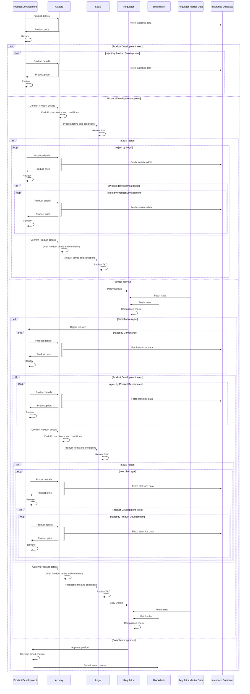

```mermaid
sequenceDiagram
    participant P as Product Development 
    participant A as Actuary
    participant L as Legal
    participant R as Regulator
    participant B as Blockchain    
    participant RDB as Regulator Master Data
    participant IDB as Insurance Database
    P->>+A: Product details
    A->>+IDB: Fetch statistics data
    A->>-P: Product price
    P->>+P: Review

    alt Product Development reject
        loop reject by Product Development
            P->>+A: Product details
            A->>+IDB: Fetch statistics data
            A->>-P: Product price
            P->>+P: Review
        end
    else Product Development approve
    P->>+A: Confirm Product details
    A->>+A: Draft Product terms and conditions
    A->>+L: Product terms and conditions
    L->>+L: Review T&C

        alt Legal reject
        loop reject by Legal
            P->>+A: Product details
            A->>+IDB: Fetch statistics data
            A->>-P: Product price
            P->>+P: Review
            alt Product Development reject
                loop reject by Product Development
                    P->>+A: Product details
                    A->>+IDB: Fetch statistics data
                    A->>-P: Product price
                    P->>+P: Review
                end
            end
            P->>+A: Confirm Product details
            A->>+A: Draft Product terms and conditions
            A->>+L: Product terms and conditions
            L->>+L: Review T&C
        end
    
    else Legal approve
    L->>+R: Policy Details
    RDB->>+R: Fetch rules
    B->>+R: Fetch rules
    R->>+R: Compliance check

    alt Compliance reject
        R->>+P: Reject reasons
        loop reject by Compliance
            P->>+A: Product details
            A->>+IDB: Fetch statistics data
            A->>-P: Product price
            P->>+P: Review
        end
    
            alt Product Development reject
                loop reject by Product Development
                    P->>+A: Product details
                    A->>+IDB: Fetch statistics data
                    A->>-P: Product price
                    P->>+P: Review
                end
            
        P->>+A: Confirm Product details
        A->>+A: Draft Product terms and conditions
        A->>+L: Product terms and conditions
        L->>+L: Review T&C
    

        alt Legal reject
            loop reject by Legal
                P->>+A: Product details
                A->>+IDB: Fetch statistics data
                A->>-P: Product price
                P->>+P: Review
                alt Product Development reject
                    loop reject by Product Development
                        P->>+A: Product details
                        A->>+IDB: Fetch statistics data
                        A->>-P: Product price
                        P->>+P: Review
                    end
                end
            end
        end
        P->>+A: Confirm Product details
        A->>+A: Draft Product terms and conditions
        A->>+L: Product terms and conditions
        L->>+L: Review T&C
        L->>+R: Policy Details
        RDB->>+R: Fetch rules
        B->>+R: Fetch rules
        R->>+R: Compliance check
    end
    else Compliance approve
    R->>+P: Approve product
    P->>+P: Develop smart contract
    P->>+B: Submit smart contract
    end
    end
    end
```
