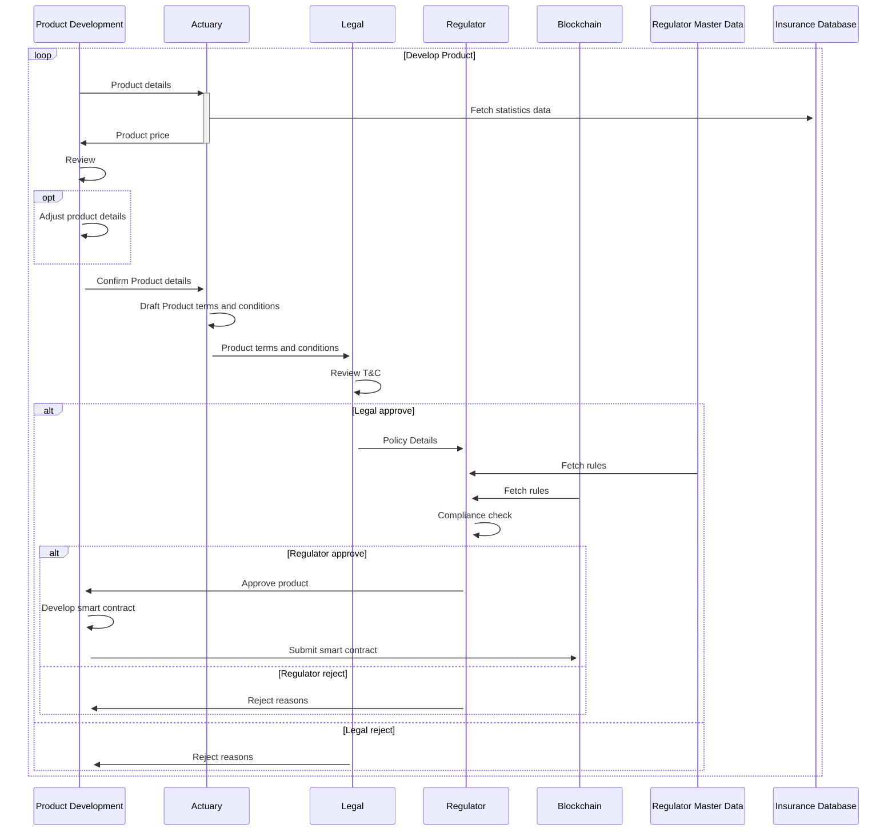

```mermaid
sequenceDiagram
    participant P as Product Development 
    participant A as Actuary
    participant L as Legal
    participant R as Regulator
    participant B as Blockchain    
    participant RDB as Regulator Master Data
    participant IDB as Insurance Database
    loop Develop Product
        P->>+A: Product details
        A->>+IDB: Fetch statistics data
        A->>-P: Product price
        P->>+P: Review
        opt 
            P->>+P: Adjust product details
        end
        P->>+A: Confirm Product details
        A->>+A: Draft Product terms and conditions
        A->>+L: Product terms and conditions
        L->>+L: Review T&C
        alt Legal approve
            L->>+R: Policy Details
            RDB->>+R: Fetch rules
            B->>+R: Fetch rules
            R->>+R: Compliance check
            alt Regulator approve
                R->>+P: Approve product
                P->>+P: Develop smart contract
                P->>+B: Submit smart contract
            else Regulator reject
                R->>+P: Reject reasons
            end
        else Legal reject
            L->>+P: Reject reasons
        end

    end

```
